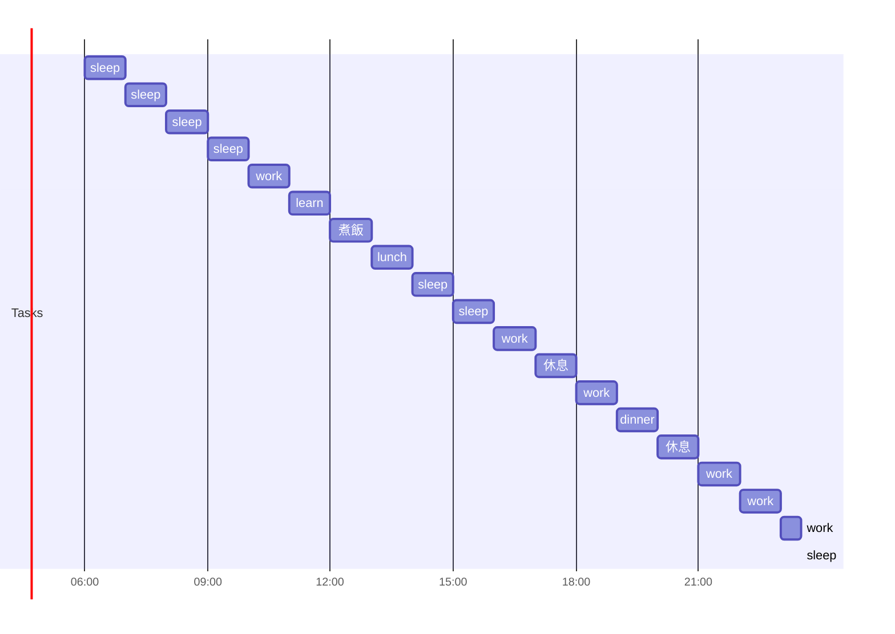

## morning
 
- [x] 06:00 sleep
- [x] 07:00 sleep
- [x] 08:00 sleep
- [x] 09:00 sleep
- [x] 10:00 work
- [x] 11:00 learn
- [x] 12:00 煮飯
      
## afternoon

- [x] 13:00 lunch
- [x] 14:00 sleep
- [x] 15:00 sleep
- [x] 16:00 work
- [x] 17:00 休息
      
## evening

- [x] 18:00 work
- [x] 19:00 dinner
- [ ] 20:00 休息
- [ ] 21:00 work
- [ ] 22:00 work
- [ ] 23:00 work
- [ ] 23:30 sleep